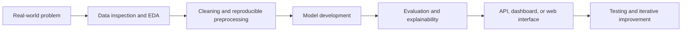

# Hi, I'm Muhammad Sleem

### Healthcare AI · Data Analytics · Machine Learning · Computer Vision

I combine clinical experience with data and software engineering to build practical, explainable systems for healthcare, rehabilitation, analytics, and intelligent automation.

---

## About Me

I am a **Healthcare AI and Data Analytics practitioner** with a background in physical therapy. My work focuses on translating real-world clinical and operational problems into reproducible data pipelines, machine-learning models, computer-vision systems, analytical dashboards, and usable applications.

My current technical interests include:

* Medical imaging and explainable AI
* Automatic license plate recognition
* Predictive analytics and classification
* Healthcare and rehabilitation analytics
* Data engineering, EDA, and model evaluation
* User-facing AI applications with Streamlit, FastAPI, and React

---

## Featured Projects

| Project                                                                                         | What It Demonstrates                                                                                                                                                                                | Core Technologies                                                      |
| ----------------------------------------------------------------------------------------------- | --------------------------------------------------------------------------------------------------------------------------------------------------------------------------------------------------- | ---------------------------------------------------------------------- |
| [**Egyptian ALPR Dataset & Recognition Pipeline**](https://github.com/Sleem13/AI-Tools-Project) | A configurable pipeline covering dataset inspection, EDA, quality checks, annotation harmonization, preprocessing, dataset splitting, plate detection, OCR, evaluation, and application interfaces. | Python, OpenCV, PyTorch, YOLOv8, CRNN/CTC, FastAPI, Streamlit, pytest  |
| [**Advanced Skin Lesion Diagnosis**](https://github.com/Sleem13/Advanced-Skin-Lesion-Diagnosis) | A developing deep-learning project structure for skin-lesion classification, model evaluation, explainability, experiment tracking, inference, and deployment.                                      | PyTorch, OpenCV, scikit-learn, Captum, Optuna, MLflow, ONNX, Streamlit |
| [**Body Performance Analytics**](https://github.com/Sleem13/AI-and-ML-Project-3.10)             | An academic machine-learning pipeline organized around data preparation, exploratory analysis, model training, and evaluation.                                                                      | Python, Data Analysis, Machine Learning, Model Evaluation              |
| [**Personal Portfolio**](https://github.com/Sleem13/Portfolio)                                  | A responsive recruiter-facing portfolio with interactive project previews, dashboard-inspired styling, SEO metadata, and GitHub Pages support.                                                      | HTML, CSS, JavaScript, GitHub Pages                                    |
| [**React Web Application**](https://github.com/Sleem13/WebPage)                                 | A modern frontend foundation with reusable UI components, validation, charts, routing, linting, and automated tests.                                                                                | React, TypeScript, Vite, Tailwind CSS, shadcn/ui, Supabase, Vitest     |

> Some repositories are active research or development projects. Their documentation distinguishes implemented components from planned work.

---

## Technical Stack

### Data, AI, and Machine Learning

### Analytics and Data Engineering

### Applications and Interfaces

### Engineering Workflow

---

## How I Approach Projects

I aim to keep projects:

* **Problem-driven** — technical decisions should serve a real use case.
* **Reproducible** — configuration, scripts, and documented steps matter.
* **Measurable** — evaluation should be based on appropriate metrics, not presentation alone.
* **Explainable** — especially for healthcare and high-impact applications.
* **Usable** — models become more valuable when exposed through clear interfaces.

---

## Current Focus

* Improving the end-to-end Egyptian license plate recognition workflow
* Developing explainable medical-image classification systems
* Strengthening testing, documentation, and experiment tracking
* Building clearer interfaces for AI and analytics projects
* Connecting healthcare knowledge with practical machine learning

---

## Background

* **Applied AI & Data Analytics**
* **Physical Therapy and Rehabilitation**
* **Healthcare Data and Clinical Problem Solving**
* **Machine Learning, BI, and Data Visualization**

This combination helps me evaluate technical systems from both the engineering side and the real-world user side.

---

## Repository Standards I Am Building Toward

* Clear project-specific README files
* Reproducible setup and environment instructions
* Structured source code and configuration
* Unit and integration testing
* Honest project-status labels
* Documented datasets, metrics, limitations, and future work
* Demonstrations through screenshots, reports, dashboards, or short videos

---

## Let's Connect

I am interested in collaborating on projects involving:

* Healthcare AI and clinical analytics
* Computer vision and medical imaging
* Rehabilitation and human-performance analytics
* Data engineering and business intelligence
* Applied machine learning and intelligent applications

**LinkedIn:** [linkedin.com/in/sleemisme](https://www.linkedin.com/in/sleemisme)
**GitHub:** [github.com/Sleem13](https://github.com/Sleem13)
**Email:** [muhammadsleem03@gmail.com](mailto:muhammadsleem03@gmail.com)

---

### Building technology that connects data, intelligent systems, and human impact.

<!--
**Sleem13/Sleem13** is a ✨ _special_ ✨ repository because its `README.md` (this file) appears on your GitHub profile.

Here are some ideas to get you started:

- 🔭 I’m currently working on ...
- 🌱 I’m currently learning ...
- 👯 I’m looking to collaborate on ...
- 🤔 I’m looking for help with ...
- 💬 Ask me about ...
- 📫 How to reach me: ...
- 😄 Pronouns: ...
- ⚡ Fun fact: ...
-->
