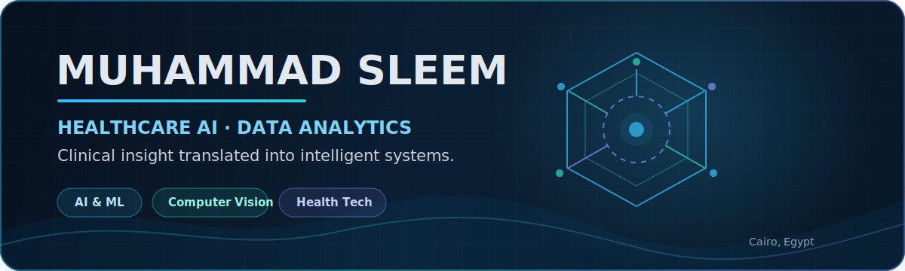

<div align="center">



<br>

[](https://www.linkedin.com/in/sleemisme)
[](https://sleem13.github.io/Portfolio/)
[](https://github.com/Sleem13)
[](mailto:muhammadsleem03@gmail.com)

</div>

## About Me

I am a **Healthcare AI and Data Analytics practitioner** with a professional background in physical therapy. I translate clinical and operational problems into reproducible data pipelines, machine-learning models, computer-vision systems, analytical dashboards, and usable applications.

My work sits at the intersection of:

- **Healthcare and rehabilitation knowledge**
- **Applied machine learning and deep learning**
- **Computer vision and explainable AI**
- **Data analytics, SQL, and business intelligence**
- **Frontend interfaces and AI-powered applications**

> **Core direction:** build systems that are technically rigorous, understandable to users, and useful in real-world settings.

---

## Featured Public Projects

<table>
<tr>
<td width="50%" valign="top">

### Egyptian ALPR Pipeline

A production-oriented pipeline for Egyptian license plates, covering inspection, EDA, data-quality checks, annotation harmonization, preprocessing, train/validation/test splitting, YOLOv8 detection, OCR, evaluation, API services, and a Streamlit interface.

**Stack:** Python · OpenCV · PyTorch · YOLOv8 · CRNN/CTC · FastAPI · Streamlit · pytest

[View repository →](https://github.com/Sleem13/AI-Tools-Project)

</td>
<td width="50%" valign="top">

### Advanced Skin Lesion Diagnosis

A developing medical-imaging system structured for transfer learning, explainability, experiment tracking, model evaluation, inference, optimization, and deployment.

**Stack:** PyTorch · OpenCV · Captum · Optuna · MLflow · ONNX · Streamlit

[View repository →](https://github.com/Sleem13/Advanced-Skin-Lesion-Diagnosis)

</td>
</tr>
<tr>
<td width="50%" valign="top">

### Body Performance Analytics

An academic machine-learning workflow focused on data preparation, exploratory analysis, reproducible model training, classification, and evaluation.

**Stack:** Python · pandas · scikit-learn · Data Visualization · Model Evaluation

[View repository →](https://github.com/Sleem13/AI-and-ML-Project-3.10)

</td>
<td width="50%" valign="top">

### Interactive Portfolio

A responsive recruiter-facing portfolio with animated interactions, dashboard-inspired styling, project previews, SEO metadata, and GitHub Pages support.

**Stack:** HTML · CSS · JavaScript · GitHub Pages

[View repository →](https://github.com/Sleem13/Portfolio)

</td>
</tr>
<tr>
<td width="50%" valign="top">

### Modern React Application

A frontend foundation using reusable components, validation, routing, charts, Supabase integration, linting, and automated tests.

**Stack:** React · TypeScript · Vite · Tailwind CSS · shadcn/ui · Supabase · Vitest

[View repository →](https://github.com/Sleem13/WebPage)

</td>
<td width="50%" valign="top">

### Egyptian Plate Detection Prototype

An earlier computer-vision project exploring detection and recognition of Egyptian vehicle plates for traffic and smart-system applications.

**Stack:** Python · Computer Vision · Deep Learning

[View repository →](https://github.com/Sleem13/-Licence_Plate_Detect_EG)

</td>
</tr>
</table>

---

## Selected Private and Collaborative Work

Some of my strongest work is private, team-owned, or not yet ready for public release. To protect collaborators and unpublished implementation details, these projects are summarized without private links.

<table>
<tr>
<td width="50%" valign="top">

### ADPilot — Content Agent & Frontend

Worked on the **Content Agent** and frontend experience for a multi-agent advertising platform. My focus includes structured content generation, agent isolation, output validation, frontend integration, maintainability, and product-facing workflows.

**Areas:** AI agents · Content generation · Frontend engineering · Modular architecture

</td>
<td width="50%" valign="top">

### Personalized Rehabilitation Recommendation System

A research-oriented reinforcement-learning system for adapting rehabilitation recommendations to patient state, progress, safety constraints, and treatment response.

**Areas:** Reinforcement learning · Healthcare AI · State/action/reward design · Safe recommendations

</td>
</tr>
<tr>
<td width="50%" valign="top">

### Healthcare & Clinical Analytics Work

Projects combining clinical understanding with predictive analytics, data modeling, dashboard design, and decision-support concepts for patient care and rehabilitation.

**Areas:** Clinical data · Power BI · SQL · Predictive modeling · Rehabilitation analytics

</td>
<td width="50%" valign="top">

### Applied AI Team Projects

Collaborative work involving computer vision, data engineering, model evaluation, technical presentations, sprint planning, and reproducible project delivery.

**Areas:** Team leadership · ML engineering · EDA · Experimentation · Technical communication

</td>
</tr>
</table>

---

## Technical Toolkit

<div align="center">

### AI, Machine Learning & Computer Vision


### Data, Analytics & Visualization


### Applications & Engineering


</div>

---

## Engineering Approach

```mermaid
flowchart LR
    A[Real-world problem] --> B[Data and requirements]
    B --> C[EDA and quality checks]
    C --> D[Reproducible preprocessing]
    D --> E[Baseline and model development]
    E --> F[Evaluation and error analysis]
    F --> G[Explainability and validation]
    G --> H[API, dashboard, or frontend]
    H --> I[Testing and iteration]
```



My projects aim to be:

- **Problem-driven** rather than technology-driven
- **Reproducible** through scripts, configuration, and documentation
- **Measurable** with appropriate evaluation metrics
- **Explainable**, especially in healthcare applications
- **Usable** through dashboards, APIs, or frontend interfaces
- **Honest** about limitations, maturity, and incomplete work

---

## Current Focus

```text
Healthcare AI          ███████████████████░
Computer Vision        ██████████████████░░
Data Analytics & BI    ██████████████████░░
AI Agent Systems       ████████████████░░░░
Frontend Integration   ███████████████░░░░░
```

- End-to-end Egyptian automatic license plate recognition
- Explainable medical-image classification
- Personalized rehabilitation using reinforcement learning
- Modular AI agents and content-generation workflows
- Production-quality documentation, testing, and deployment

---

## GitHub Activity

<div align="center">


<br>


</div>

> GitHub activity cards are generated by third-party services and may occasionally be unavailable.

---

## Background

| Area | Details |
|---|---|
| Healthcare | Physical therapy, rehabilitation, clinical reasoning, sports injuries, and patient-centered problem solving |
| AI & Data | Applied AI, machine learning, deep learning, analytics, and reproducible modeling workflows |
| Business Intelligence | Power BI, DAX, SQL, data modeling, ETL, and decision-support dashboards |
| Engineering | Python project structure, testing, APIs, Streamlit applications, React interfaces, and Git workflows |
| Communication | Technical presentations, project leadership, documentation, and recruiter-facing storytelling |

---

## Collaboration

I am interested in collaborating on:

- Healthcare AI and clinical decision-support systems
- Computer vision and medical imaging
- Rehabilitation and human-performance analytics
- Applied machine learning and intelligent agents
- Data engineering, BI, and analytical applications

<div align="center">

### Let’s build systems where technical quality meets real human impact.

[LinkedIn](https://www.linkedin.com/in/sleemisme) ·
[Portfolio](https://sleem13.github.io/Portfolio/) ·
[GitHub](https://github.com/Sleem13) ·
[Email](mailto:muhammadsleem03@gmail.com)

</div>
